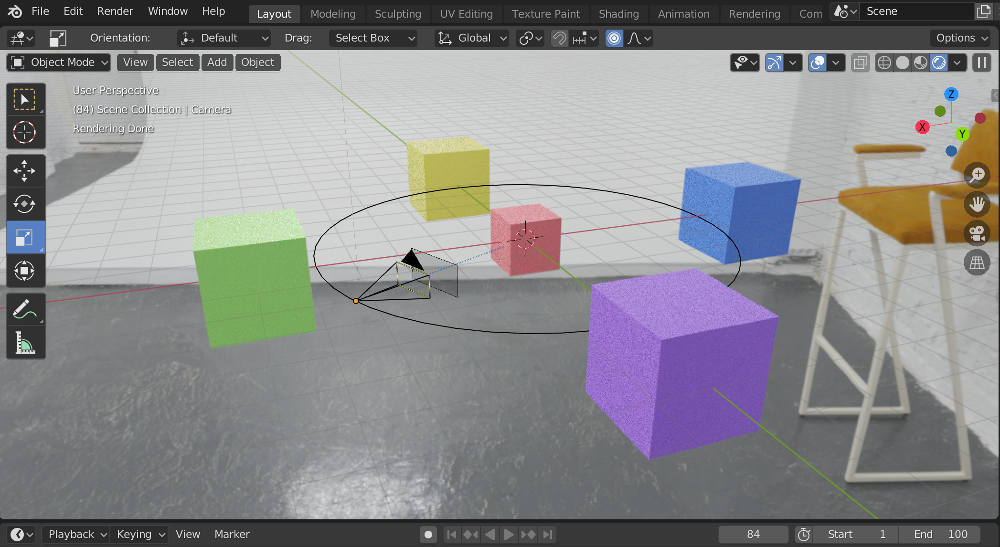
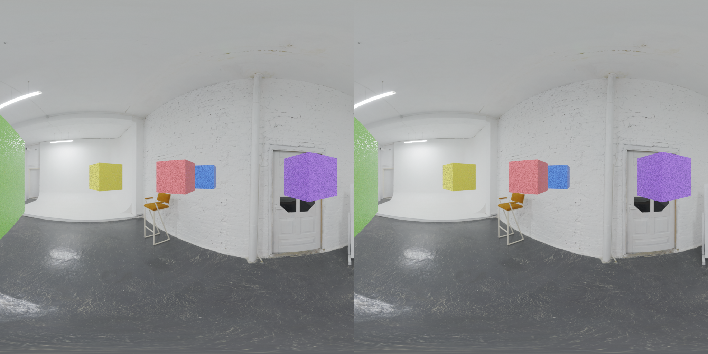
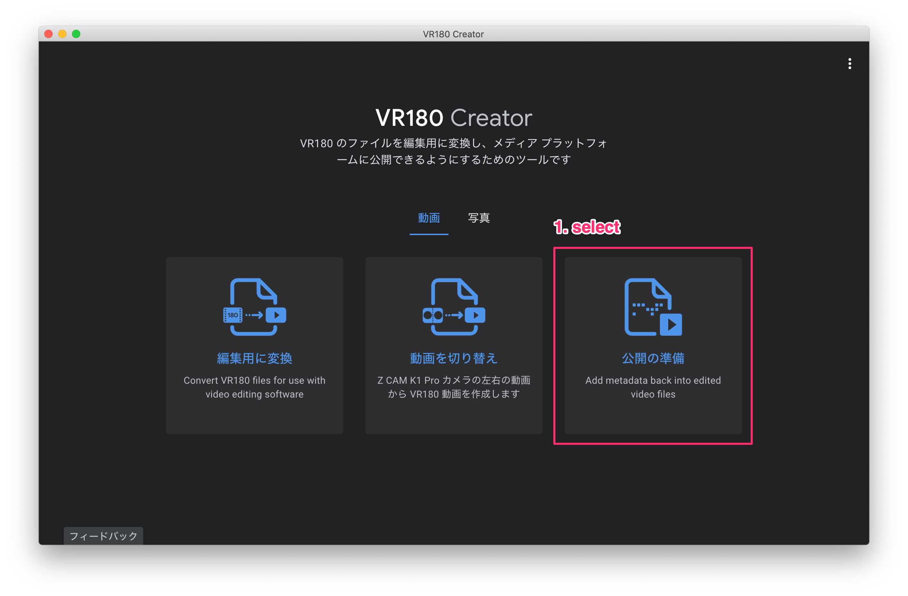
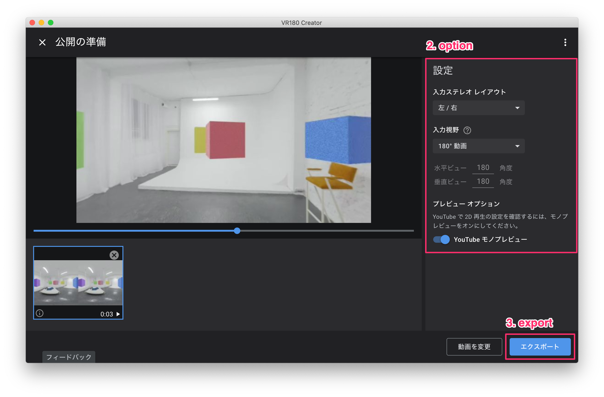

## Blender 2.8 VR180 test video



YouTube: https://www.youtube.com/watch?v=a9ImTpUU96U

### Blender: settings

```
[Properties]

Render
    Render Engine -> Cycles

Output
    Dimensions
        Resolution // (x, y) = (1, 1)
            X -> 1024 *** ANY ***
            Y -> 1024 *** ANY ***
        Frame Rate -> *** ANY ***
    Stereoscopy
        Stereo 3D -> Selected
    Output
        File Format -> FFmpeg video
        Views
            Views Format
                Stereo 3D -> Selected
            Stereo Mode
                Side-by-Side -> Selected                
    Encoding
        Container -> MPEG-4

World
    Color -> *** ANY ***

Object Data
    Lens
        Type -> Panoramic
        Panorama Type -> Equirectangular
        Latitude
            Min -> -90 degree
            Max ->  90 degree
        Longitude
            Min -> -90 degree
            Max ->  90 degree
```

### Blender: render animation

output

```
0001-0100_vr180.mp4
```



### for YouTube: VR180 metadata

Install VR180 Creator

```
https://arvr.google.com/vr180/apps/
```





output

```
0001-0100_vr180_injected.mp4
```
