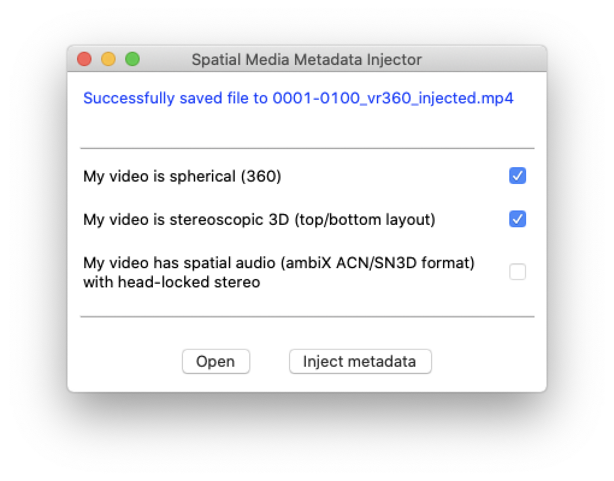

## Blender 2.8 VR360 test video


YouTube: https://www.youtube.com/watch?v=R2mpcPNXQG8

### Blender: settings

```
[Properties]

Render
    Render Engine -> Cycles

Output
    Dimensions
        Resolution // (x, y) = (2, 1)
            X -> 2048 *** ANY ***
            Y -> 1024 *** ANY ***
        Frame Rate -> *** ANY ***
    Stereoscopy
        Stereo 3D -> Selected
    Output
        File Format -> FFmpeg video
        Views
            Views Format
                Stereo 3D -> Selected
            Stereo Mode
                Top-Bottom -> Selected                
    Encoding
        Container -> MPEG-4

World
    Color -> *** ANY ***

Object Data
    Lens
        Type -> Panoramic
        Panorama Type -> Equirectangular
        Latitude
            Min -> -90 degree
            Max ->  90 degree
        Longitude
            Min -> -180 degree
            Max ->  180 degree
```

### Blender: render animation

output

```
0001-0100_vr360.mp4
```

### for YouTube:

```
// https://github.com/google/spatial-media/releases/tag/v2.1
```



output

```
0001-0100_vr360_injected.mp4
```
